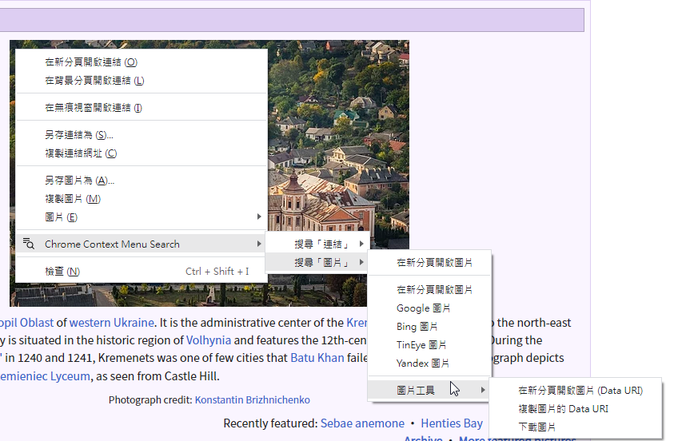
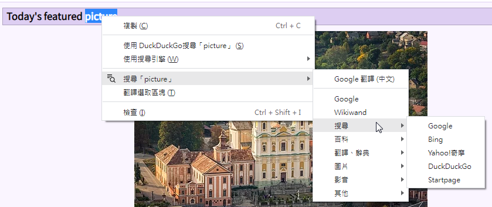

# Context Menu Search

為一個 Chrome 擴充插件，透過右鍵選單文字搜尋、圖片搜尋、網站翻譯...等功能

由於是自用套件，因此選單項目是固定的，沒有提供 GUI 設定介面

## Screenshot

---

## Reference

* https://developer.chrome.com/docs/extensions/reference/contextMenus/
* https://ithelp.ithome.com.tw/articles/10187476